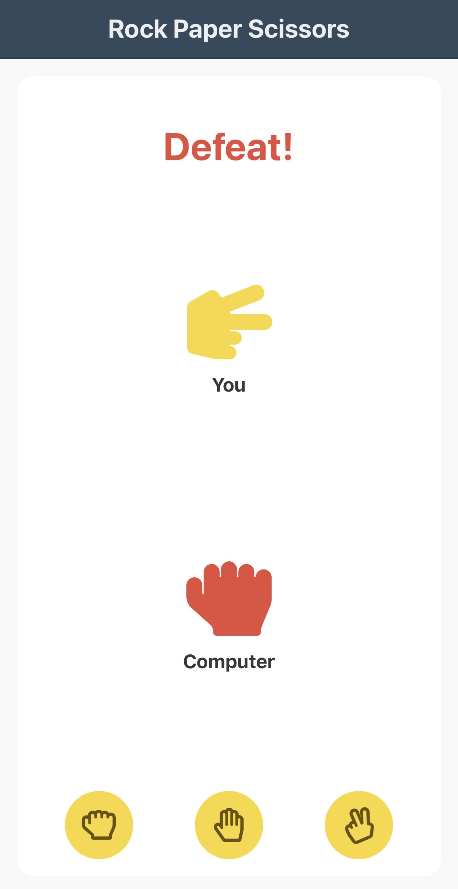

## Rock-Paper-Scissors Mobile App

### Overview
This React Native application brings the classic Rock-Paper-Scissors game to your mobile device. Challenge yourself by choosing between rock, paper, or scissors, and compete against the computer to see who comes out victorious.

### Key Features
- Intuitive and responsive UI
- Animated transitions for a dynamic user experience
- Player vs. Computer gameplay
- Easy-to-use interface for choosing between rock, paper, and scissors

### Technologies Used
- React Native
- Expo
- FontAwesome5 for vector icons

### How to Run
1. Clone the repository.
2. Install dependencies using `npm install`.
3. Run the app using `npm start` or `expo start`.

### Running on a Mobile Device
#### For iOS:
1. Download and install the Expo Go app from the [App Store](https://apps.apple.com/app/apple-store/id982107779).
2. Open Expo Go and scan the QR code displayed in the terminal after running `npm start` or `expo start`.

#### For Android:
1. Download and install the Expo Go app from [Google Play](https://play.google.com/store/apps/details?id=host.exp.exponent&pcampaignid=web_share).  
2. Open Expo Go and scan the QR code displayed in the terminal after running `npm start` or `expo start`.

Enjoy playing Rock-Paper-Scissors on your mobile device!

## Screenshots of the Mobile App
**Home Screen**
   - The main screen where you choose your move.
   

**Victory Screen**
   - Celebrate your victory!
   

**Defeat Screen**
   - Learn from defeat and try again.
   

**Draw Screen**
   - It's a draw! Test your skills again.
   
